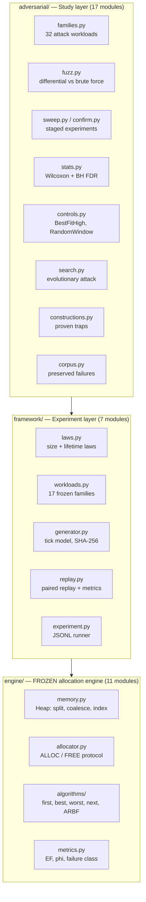
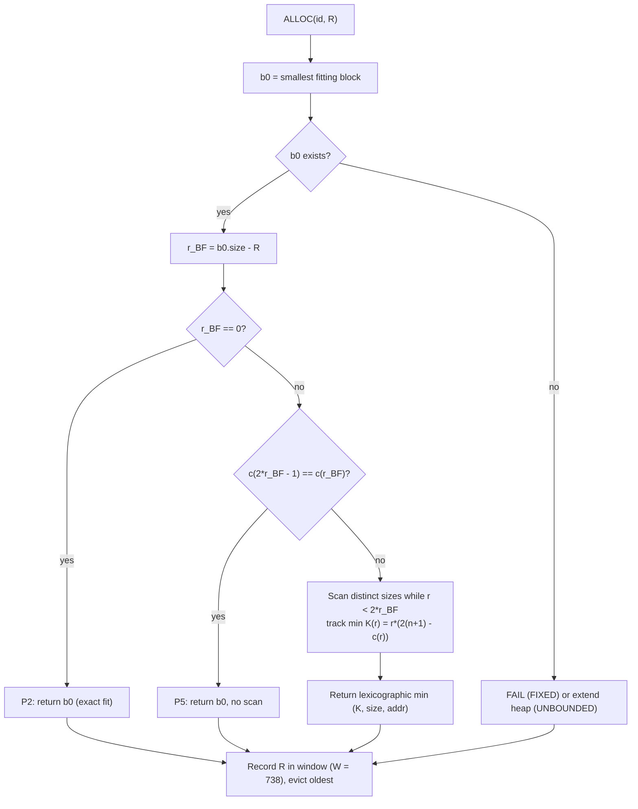
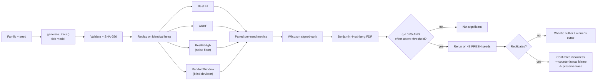

# Self-Tuning Best-Fit Allocator

## A History-Adaptive Dynamic Memory Allocation Policy — System Design, Implementation and Adversarial Evaluation

---

## 0. Presentation brief — the five-minute version

*This page stands alone. Read only this to present the project; everything after it is supporting detail for the written submission.*

**Scope marker used throughout:** headings tagged **[CORE]** are the **61% of the code in scope for this review**. Headings tagged **[EXTENDED]** describe work that is built and passing, but deliberately held outside this submission's scope — see §1.4.

### The four things to say

**1 · The problem — 45 seconds.**
A memory allocator gets requests one at a time and cannot see the future. Its only decision is *which free block to cut each request out of*. Cut badly and you leave slivers nobody can use: eventually there is plenty of free memory in total but no single block big enough, so the allocation fails. That is **external fragmentation**, and in a fixed-size arena it is a crash, not a slowdown. The standard defence is **Best Fit** — take the smallest block that fits.

**2 · The idea — 60 seconds.**
Best Fit minimises the *size* of the leftover but never asks whether the leftover is *useful*. Cutting 100 from a 101-block leaves a dead 1-unit sliver. Cutting the same 100 from a 140-block leaves 40 — and if the program keeps asking for 40s, that leftover gets used immediately.

So ARBF remembers the last **738** request sizes and prices each candidate leftover `r` with

> **K(r) = r · (2(n + 1) − c(r))**, where `c(r)` counts remembered requests that fit in `r`.

Small is still cheap (the `r` term), but a leftover that matches what the program actually asks for gets up to a **50% discount**. With no history it is exactly Best Fit, and it never looks past `r < 2·r_BF`, so it can never degenerate into Worst Fit.

**3 · The demo — 60 seconds.** One command:

```
python -m adversarial constructions
```

Point at two lines of the output:

| Trace | Best Fit | ARBF |
|---|---|---|
| `rare-large-trap` | **0 failures** | **200 failures** |
| `reverse-trap` | **200 failures** | **0 failures** |

"Same engine, same rules, mirrored workloads. ARBF is catastrophically worse on the first and catastrophically better on the second. **Neither policy dominates** — which is exactly what Robson proved in 1977 for *all* online allocators. So the question is never *is it better*, it is *where is it better, and why*."

**4 · The finding — 90 seconds.**

> ARBF is **not** a general improvement over Best Fit. On most workloads it makes the *identical* placement and just costs ~1.4× the search time. It is **6–38% better** on one identifiable class — a few dominant request sizes, tight memory, leftovers landing just below a popular size. It is **~8% worse** on one specific class — when popular sizes *add up* to another requested size (40 + 100 = 140), because it prices each leftover in isolation and trades a tileable set of holes for an untileable one.

Then the methodology point, which is what makes the finding credible:

"Allocation is **chaotic** — one different placement reshapes the entire future heap, so a single good benchmark run proves nothing. So every trace is also replayed by two controls: **Best Fit with the tie-break flipped**, which measures how big a gap pure noise produces, and a **history-blind random deviator** that deviates exactly as often as ARBF. If ARBF can't beat the blind one, its *learning* isn't what's doing the work. On the one confirmed weakness, ARBF loses even to the blind deviator — that's how we know it's a real defect in the cost function and not luck."

### If asked, the three best answers

| Question | Answer |
|---|---|
| "How do you know the code is correct?" | A second, deliberately naive implementation was written straight from the formula — full scan, no shortcuts, no indices — and **4.64 million decisions** were compared one by one. 0 mismatches, 0 property violations. |
| "Isn't this just tuned to look good?" | The algorithm, the heap model and the 17 workload families were **frozen before any benchmark ran**, and the test suite pins their SHA-256. Any edit fails the build. The confirmatory-rerun rule was fixed in advance too — which is how we caught our own best "ARBF is worse" result collapsing from a fitness of 0.94 to statistical noise on fresh seeds. |
| "What does it cost?" | ~1.4× Best Fit's search time typically; the `scan-cost-blowup` trace shows a **250×** worst case. That is the honest price, and it is in the report. |

### One-line summary

*A memory allocator that learns which leftover sizes its program actually reuses — together with an adversarial study that establishes exactly where that helps, where it hurts, and why.*

---

## 1. Introduction

### 1.1 The problem

A dynamic memory allocator answers a stream of requests it cannot see in advance. `ALLOC(id, R)` asks for a contiguous run of `R` units; `FREE(id)` gives one back. Between them, the heap turns into a patchwork of used and free blocks. The allocator's only decision is **which free block to cut a request out of**, and it must decide now, without knowing what comes next.

That decision is where fragmentation is born. **External fragmentation** is the state where enough memory is free in total but no single free block is large enough to serve a request. The allocation fails even though the memory exists. In a fixed-size arena — an embedded controller, a real-time system, a kernel pool, a GPU buffer — that failure is not a slowdown, it is a crash.

**Best Fit** is the classical answer: take the smallest free block that fits. It is the strongest simple policy in the literature and it is the baseline this project targets. But Best Fit is deliberately blind. It minimises the *size* of the leftover, never asking whether the leftover is *usable*. Cutting 100 units from a 101-unit block leaves a 1-unit sliver that most programs can never use again. Cutting the same 100 from a 140-unit block leaves 40 — which, if the program keeps asking for 40s, is a block that will be used immediately.

### 1.2 The idea

**ARBF (Adaptive Residual Best Fit)** keeps a sliding window of the last `W = 738` request sizes and uses it to price the leftover each candidate block would produce. It scores a residual `r` with

> **K(r) = r · (2(n + 1) − c(r))**

where `n` is the number of remembered requests and `c(r)` counts how many of them would fit in `r`. Writing `Ĝ(r) = c(r)/(n+1)` for the empirical fraction of recent requests that fit, the cost factorises as `K(r) = (n+1) · r · (2 − Ĝ(r))`.

The shape of that formula is the whole design:

- The `r` factor is Best Fit's instinct — small leftovers are cheap.
- The `(2 − Ĝ(r))` factor is the learned correction — a leftover that matches sizes the program actually asks for is discounted by up to half; one that nothing fits pays full price.

ARBF picks the lexicographic minimum of `(K, size, address)` over fitting blocks. So it will pass over the tightest block, but only when a slightly larger one leaves a demonstrably more reusable remainder. With empty history it is exactly Best Fit, and it never searches beyond `r < 2·r_BF`.

### 1.3 What this project delivers

The project is **not** a single allocator file. It is three layers: a verified allocation engine, a preregistered experimental framework, and a full adversarial study of the resulting policy.

The honest headline, established by that study, is:

> ARBF is not a universal improvement over Best Fit. It is **6–38% better on one identifiable class of workloads**, measurably worse on a second, identical on most, and its worst case — like every online allocator's — is unbounded.

Reaching a conclusion that specific, and being able to defend it, is what most of the engineering here is for. A benchmark that reports "our allocator is 12% better" without controls, without replication, and without a search for its own counterexamples is not evidence; allocation is a chaotic process where a single differing placement reshapes the entire future heap, so one good trace proves nothing.

| Deliverable | Scale |
|---|---|
| Allocation engine, 5 placement policies | 5 modules, frozen and SHA-256 pinned |
| Experimental framework, 17 preregistered workload families | 7 modules, deterministic trace generation |
| Adversarial study, 32 attack families, 7 stages | 17 modules |
| Test suite | **543 tests, all passing** |
| Preserved reproducible failures | 23 traces with exact expected outcomes |
| Total | **~5,033 lines of Python**, dependencies: `pytest`, `scipy` |

### 1.4 Scope of this review — the 61% core

The repository is complete and every test passes. For this submission the code is nevertheless divided into two parts, and **only Part A is presented and defended**. Part A is not "the finished portion" — it is the portion that forms a self-contained, demonstrable prototype: an allocator you can run, a benchmark that measures it, a test suite that verifies it, and a set of traces that prove the central claim.

| | Part | Contents | Lines | Share |
|---|---|---|---:|---:|
| **A** | **[CORE] — in scope** | `engine/` (heap model, ALLOC/FREE protocol, all 5 policies, metrics, traces) · `framework/` (laws, 17 frozen workload families, trace generator, replay, benchmark CLI) · 474 of the 543 tests · `adversarial/constructions.py` (the 7 proven traps) | **3,067** | **60.9%** |
| **B** | [EXTENDED] — built, out of scope | The statistical study: differential fuzzing, the 49-family sweep, confirmatory reruns, Wilcoxon + Benjamini–Hochberg, the two controls, evolutionary search, counterfactual attribution, the preserved-failure corpus, and their 69 tests | 1,966 | 39.1% |
| | **Total** | | **5,033** | 100% |

The boundary is the repository's own commit boundary. Commit `14ead70` delivered Part A's engine and framework with **474 tests**; commit `499190b` added Part B. The two parts are separable in exactly the way the layering in §3.2 predicts: **Part A runs, benchmarks and verifies the allocator; Part B establishes statistical confidence in what the benchmark shows.**

**What Part A alone can demonstrate.** All five allocation policies running on a verified heap; the full ARBF decision procedure including P1–P5; deterministic, hash-verified trace generation across 17 preregistered workload families; paired benchmarking with fragmentation and failure metrics; 474 passing tests including differential checks against brute force and heap-invariant validation after *every single event*; and the seven handcrafted constructions — including the mirrored 200-vs-0 pair that proves neither policy dominates.

**What only Part B adds.** Not new functionality, but *warranted confidence*: that the observed differences are not chaos. Statements in this report of the form "confirmed on 48 fresh seeds", "q < 0.05 after FDR correction", "loses even to a rate-matched blind deviator" and "4.64 M decisions vs a brute-force oracle" all rest on Part B. Sections carrying those claims are tagged **[EXTENDED]** and are reported here for completeness.

---

## 2. Literature Survey

### 2.1 The classical policies and what is known about them

Sequential-fit allocation is one of the oldest problems in systems programming, and Knuth's treatment in *The Art of Computer Programming* [1] still defines the vocabulary: First Fit, Best Fit, Worst Fit, Next Fit, boundary tags for coalescing, and the *fifty-percent rule* relating live blocks to free blocks at equilibrium.

The decisive empirical result is **Wilson, Johnstone, Neely and Boles' survey** [2], which reviewed thirty-five years of allocator studies and delivered an uncomfortable verdict: most of them were measuring the wrong thing. Studies had been run on **synthetic traces drawn from smooth random distributions**, and those traces destroy exactly the structure — size regularity, phase behaviour, lifetime correlation — that determines real fragmentation. The survey's conclusion was that Best Fit and address-ordered First Fit perform far better on real programs than the random-trace literature suggested.

**Johnstone and Wilson** [3] followed it with *The Memory Fragmentation Problem: Solved?*, measuring eight real C programs and finding that good policies produce almost no fragmentation at all — under 1% for Best Fit once allocator overhead is separated from true fragmentation. This is the most important prior result for this project, and the reason the evaluation here is built the way it is: **Best Fit is already very strong**, so a policy claiming to improve on it must be tested against it directly, paired, with controls, or the claim is noise.

The theory side is equally sobering. **Robson** [4, 5] proved that any online allocator has a worst case: for a heap holding `M` units with maximum request size `m`, Best Fit can require `Ω(M log m)` memory, and no online policy escapes a worst-case bound of that order. **Shore** [6] showed that Best Fit's advantage over First Fit is not universal and depends on the size distribution. The lesson, which this project takes as a design constraint, is that **no online policy dominates another** — so the correct research question is never "is X better?" but "**on which workloads is X better, and why?**"

### 2.2 Modern allocators and where adaptivity already appears

Production allocators mostly sidestep the sequential-fit question with structure rather than smarter search. **Lea's dlmalloc** [7] uses size-segregated bins with approximate best fit. **Kingsley's BSD malloc** trades memory for speed with power-of-two size classes. **Berger et al.'s Hoard** [8] targets multiprocessor scalability with per-processor heaps. **jemalloc** [9] uses size classes and arenas to control both fragmentation and contention. **TLSF** [10] provides *O(1)* good-fit allocation with bounded response time for real-time systems.

Adaptivity in these systems is almost always **structural and offline**: size classes chosen at design time, bin layouts tuned to observed workloads. Several systems do learn online — **Zorn and Grunwald** [11] evaluated allocator models against real traces and profile-driven tuning, and **Feng and Berger** [12] used a locality-improving reachability model. But a policy that, per decision, prices a candidate residual against a live empirical distribution of recent request sizes is a narrower and less-studied idea. ARBF sits in that gap: **no size classes, no offline tuning, no profiling pass — one sliding window and one cost function.**

### 2.3 Evaluation methodology

Because the survey literature shows that allocator benchmarking is easy to get wrong, this project also draws on experiment-design work outside systems. **Wilcoxon's signed-rank test** [13] gives a distribution-free paired test appropriate for per-seed differences. **Benjamini and Hochberg's FDR procedure** [14] controls false discoveries when testing hundreds of workload cells at once — indispensable here, since a sweep of 49 families × 6 pressures will otherwise manufacture "significant" results by sheer multiplicity. **Ioannidis** [15] characterises the winner's-curse effect that makes selected-best results shrink on retest; this project observed exactly that and reports it in §6. **Hoefler and Belli** [16] set out benchmarking rules for systems work — report distributions, not single runs — which the paired per-seed design follows.

### 2.4 Gap addressed by this work

| Prior work | What it establishes | What it leaves open |
|---|---|---|
| Knuth [1], Shore [6] | Sequential-fit policies and their equilibrium behaviour | No use of request history in the placement decision |
| Wilson et al. [2], Johnstone & Wilson [3] | Best Fit is strong; synthetic traces mislead | How to *test* a new policy credibly against it |
| Robson [4, 5] | Every online policy has an unbounded worst case | Which realistic workloads trigger which policy's worst case |
| dlmalloc [7], Hoard [8], jemalloc [9], TLSF [10] | Structural adaptation: bins, classes, arenas | Per-decision adaptation from an online request distribution |

This project contributes (a) a precise, frozen specification of one such per-decision adaptive policy, (b) a verified implementation, and (c) **an adversarial evaluation whose explicit goal is to find where the policy loses** — the part that allocator papers most often omit.

---

## 3. Proposed Methodology — Architecture and Design

### 3.1 Design principles

Four constraints shaped the architecture, and each one is visible in the module layout.

**P1 — The policy must be a pure function of observable state.** An allocator sees only `(id, size)` per event. It may not read metrics, future events, or trace metadata. This is enforced structurally: `Allocator.select(size)` receives nothing else, and the metrics module imports nothing from the algorithms.

**P2 — Mechanism and policy are separate.** Splitting, coalescing, address ordering and failure handling are identical for every policy and live in `engine/memory.py` and `engine/allocator.py`. A policy is one method. This guarantees that a measured difference between two allocators comes from the *decision*, never from a different heap implementation.

**P3 — The algorithm is frozen before evaluation.** ARBF V1, the heap model and the 17 workload families were fixed and their parameters recorded before any benchmark ran. The test suite pins their SHA-256 hashes, so any edit fails the build. This removes the strongest source of bias in allocator work: tuning the policy after seeing results.

**P4 — Every number must be reproducible from a seed.** Traces are generated from a string-seeded RNG, validated and SHA-256-hashed *before* any allocator sees them, then replayed identically by every policy. Determinism is itself tested across processes.

### 3.2 Layered architecture



The dependency arrow points one way only. The study layer generates traces and replays them; it cannot reach into the engine to change behaviour. This is what makes the adversarial results trustworthy — the attacker and the subject are separated by an interface that the attacker cannot modify.

### 3.3 The memory model **[CORE]**

One contiguous address range, tiled by blocks. Two modes:

- **FIXED** — an arena `[0, H)`. A request that fits nowhere **FAILs**; the heap is unchanged. Metric: *failed allocations*.
- **UNBOUNDED** — the heap grows on demand; `E` is a high-water mark. Nothing ever fails. Metric: *peak heap end* (footprint).

Mechanism rules, identical for all five policies:

1. Allocation is placed at the **low end** of the chosen block; the residual splits off at the **high end**.
2. `FREE` **coalesces immediately** with both address neighbours.
3. Ties break by **lowest address**.
4. A failed `ALLOC` still counts as an observed request.

The heap maintains three indices — free blocks by address, free blocks by `(size, addr)`, allocated blocks by id — so `smallest_fitting` and `smallest_size_above` are both `O(log n)`. Without the `(size, addr)` index, ARBF's window scan would dominate runtime.

### 3.4 The ARBF decision procedure **[CORE]**

This is the core of the proposal. Five properties are guaranteed by construction:

| Property | Statement | Purpose |
|---|---|---|
| **P1** | `n = 0` ⟹ ARBF = Best Fit | Cold start is never worse by design |
| **P2** | An exact fit (`r = 0`) always wins | `K(0) = 0`, the global minimum |
| **P3** | `r · (n + 2) ≤ 2(n + 1) · r_BF` | The chosen residual is bounded relative to Best Fit's |
| **P4** | Only blocks with `r < 2·r_BF` are considered | Bounds the scan; ARBF is never Worst Fit |
| **P5** | If no remembered size lies in `(r_BF, 2·r_BF)`, return `b₀` immediately | Skips the scan when history cannot change the answer |



**When does ARBF actually deviate from Best Fit?** Solving `K(r) < K(r_BF)` gives the deviation condition:

> **Ĝ(r) − Ĝ(r_BF) > (1 − r_BF/r) · (2 − Ĝ(r_BF))**

This inequality explains the whole envelope, and every experimental result in §6 is a consequence of it:

- A **larger** residual must buy a **strictly higher** fraction of fitting recent requests, and the further `r` is from `r_BF`, the more it must buy.
- With continuous sizes, `Ĝ` rises smoothly, so the jump never materialises: **ARBF becomes Best Fit**.
- With a few dominant sizes, `Ĝ` is a step function, so crossing one popular size can satisfy it in one move: **ARBF deviates and often wins**.
- With tiny `r_BF`, the required gain approaches `(2 − Ĝ)`, which is unreachable: **ARBF never deviates on small objects.**

### 3.5 Experimental workflow **[EXTENDED]**



**The two controls are the methodological core.** Because allocation is chaotic, a difference between ARBF and Best Fit could be caused by *any* perturbation rather than by ARBF's learning. So two reference policies run on every trace:

1. **`BestFitHigh`** — Best Fit with the *opposite* tie-break. Identical policy quality; differs only on ties. Whatever gap it produces is **the noise floor**. If ARBF's gap does not exceed it, the gap means nothing.
2. **`RandomWindow`** — a **history-blind** deviator that deviates inside exactly ARBF's P4 window, at a rate tuned per trace to match ARBF's deviation count. If ARBF does not beat it, then ARBF's outcomes come from *deviating at all*, not from *what it learned*. This is the control that separates a real learning signal from a lucky perturbation, and it is the one that most allocator evaluations lack.

The full pipeline:

| Stage | What it does | Scale |
|---|---|---|
| 0 | Differential fuzz against a brute-force implementation of the spec | 776 traces, **4.64 M decisions** |
| 1 | Systematic sweep: 49 families × 6 pressures | 12 seeds × 50k events = **3,528 paired runs** |
| 1b | Confirmatory rerun, rule fixed in advance (`p < 0.10` or \|W−L\| ≥ 6) | 38 cells × **48 fresh seeds** |
| 2 | Evolutionary search for ARBF-hostile workloads, then validation | 25 generations × 48 genomes |
| 3 | Rate-matched blind-deviator control | 10 families × 3 pressures × 48 seeds |
| 4 | Cold start / short traces | 10 families × {100, 300, 1000, 3000} events × 300 seeds |
| 5 | Handcrafted constructions with proofs | 7 traces |
| 6 | Counterfactual attribution: which single deviation caused the failure | every corpus entry |

---

## 4. Module Design and Implementation

### 4.1 Module inventory

The **Part** column marks the scope boundary from §1.4. Part A totals **3,067 lines (60.9%)**; §4.2–4.5 and §5.1–5.2 explain it. Part B is listed for completeness and summarised in §4.6–4.9.

| Part | Layer | Module | Lines | Responsibility |
|:---:|---|---|---:|---|
| **A** | engine | `memory.py` | 260 | Heap: blocks, split, coalesce, three indices, both modes |
| **A** | engine | `allocator.py` | 62 | ALLOC/FREE protocol, FAIL handling, post-decision hook |
| **A** | engine | `algorithms/arbf.py` | **83** | **The subject — ARBF V1, frozen** |
| **A** | engine | `algorithms/best_fit.py` | 12 | Baseline |
| **A** | engine | `algorithms/{first,worst,next}_fit.py` | 58 | Reference policies |
| **A** | engine | `metrics.py` | 49 | External fragmentation, Φ, failure classification |
| **A** | engine | `trace.py` | 83 | Immutable trace representation + validation |
| **A** | framework | `laws.py` | 164 | Uniform, Geometric, Exponential, LogNormal, LogUniform, Mixture |
| **A** | framework | `workloads.py` | 171 | 17 preregistered families |
| **A** | framework | `generator.py` | 101 | Tick model, determinism, SHA-256 hashing |
| **A** | framework | `replay.py` | 192 | Paired replay, metric collection, ARBF diagnostics |
| **A** | framework | `experiment.py` + `__main__.py` | 157 | JSONL runner and benchmark CLI |
| **A** | study | `constructions.py` | 208 | 7 traps with proven outcomes |
| **A** | tests | 11 test modules | 1,454 | **474 tests** |
| | | **Part A total** | **3,067** | **60.9%** |
| B | study | `families.py` | 155 | 32 attack workloads |
| B | study | `controls.py` | 64 | `BestFitHigh`, `RandomWindow` |
| B | study | `fuzz.py` | 159 | Brute-force spec reference + property checks |
| B | study | `measure.py` | 167 | `compare`, `probe`, `blame` |
| B | study | `stats.py` | 132 | Wilcoxon, BH FDR, effect thresholds |
| B | study | `search.py` | 264 | Evolutionary search over workload genomes |
| B | study | `sweep.py`, `confirm.py`, `coldstart.py` | 126 | Staged experiment drivers |
| B | study | `corpus.py` + `build_corpus.py` | 314 | Preserved-failure corpus |
| B | study | `mechanisms.py`, `report.py`, `informativeness.py`, `__main__.py` | 422 | Attribution, tables, control runs, study CLI |
| B | tests | `test_adversarial.py` | 163 | **69 tests** incl. the SHA-256 freeze guard |
| | | **Part B total** | **1,966** | **39.1%** |

*Package `__init__.py` files (13 lines across Part A, already counted in the totals) are omitted from the rows. Totals are from `wc -l`; test counts are from `pytest --collect-only`.*

### 4.2 Engine — the allocator protocol **[CORE]**

Every policy inherits one protocol. A policy author writes exactly one method, and cannot accidentally change the mechanism.

```python
class Allocator(ABC):
    def alloc(self, alloc_id: int, size: int) -> Optional[Block]:
        """ALLOC(id, R). Returns the placed block, or None on FAIL (FIXED mode only)."""
        if not is_int(size) or size < 1:
            raise InvalidRequest(f"request size must be an integer >= 1, got {size!r}")
        if self.is_live(alloc_id):
            raise InvalidRequest(f"allocation id {alloc_id} is already live")
        chosen = self.select(size)                      # <-- the ONLY policy hook
        if chosen is not None:
            placed = self.heap.place(chosen, alloc_id, size)
        elif self.heap.mode is Mode.FIXED:
            self._failed.add(alloc_id)                  # FAIL: heap unchanged
            placed = None
        else:
            placed = self.heap.extend(alloc_id, size)   # UNBOUNDED: grow
        self._after_alloc(size, placed)                 # history update, incl. FAILs
        return placed

    @abstractmethod
    def select(self, size: int) -> Optional[Block]:
        """Return a free block with block.size >= size, or None only if none fits."""
```

The baseline is then two lines, which is the point — the comparison is between decisions, not implementations:

```python
class BestFit(Allocator):
    name = "best_fit"

    def select(self, size: int) -> Optional[Block]:
        return self.heap.smallest_fitting(size)
```

### 4.3 Engine — ARBF V1 (the subject) **[CORE]**

The complete policy. Note `_count_le` on a sorted multiset (`O(log n)`), exact integer arithmetic in `cost` (no floating-point ties), and the P2/P5/P4 steps in order.

```python
W = 738  # history window; beta = 1 and kappa = 1 are built into cost()

class ARBF(Allocator):
    name = "arbf"

    def __init__(self, heap: Heap):
        super().__init__(heap)
        self._hist: Deque[int] = deque()   # last <= W request sizes, oldest first
        self._cnt: List[int] = []          # the same sizes, sorted (multiset for count_le)

    def _count_le(self, x: int) -> int:
        return bisect_right(self._cnt, x)

    def cost(self, r: int) -> int:
        """K(r) = r * (2(n+1) - c(r)), exact integer arithmetic."""
        n = len(self._hist)
        return r * (2 * (n + 1) - self._count_le(r))

    def select(self, size: int) -> Optional[Block]:
        b0 = self.heap.smallest_fitting(size)
        if b0 is None:
            return self._decide("none", None, None, 0)
        rbf = b0.size - size
        if rbf == 0:
            return self._decide("exact", b0, b0, 0)                 # P2
        if self._count_le(2 * rbf - 1) == self._count_le(rbf):
            return self._decide("shortcut", b0, b0, 2)              # P5
        best, best_k = b0, self.cost(rbf)
        queries = 3                                                 # two P5 queries + cost(rbf)
        b = self.heap.smallest_size_above(b0.size)                  # next distinct size
        while b is not None and b.size - size <= 2 * rbf - 1:       # P4
            k = self.cost(b.size - size)
            queries += 1
            if k < best_k:   # strict: earlier block has smaller size / lower address
                best, best_k = b, k
            b = self.heap.smallest_size_above(b.size)               # skip duplicates
        return self._decide("scan", b0, best, queries)

    def _record_request(self, size: int) -> None:
        self._hist.append(size)
        insort(self._cnt, size)
        if len(self._hist) > W:
            oldest = self._hist.popleft()
            del self._cnt[bisect_left(self._cnt, oldest)]
```

Three implementation details carry real weight. **Strict `<`** in the comparison implements the lexicographic `(K, size, addr)` tie-break without a second sort key. **`smallest_size_above`** skips duplicate sizes, so the scan visits distinct sizes only. **`_record_request` runs after the decision and also on FAIL**, so a request the allocator could not serve still teaches it that the size is popular.

### 4.4 Framework — deterministic trace generation **[CORE]**

Traces are generated, validated and hashed **before** any allocator runs. Determinism comes from a *string*-seeded RNG, which Python hashes with SHA-512 — stable across processes and platforms, unlike integer seeding.

```python
def generate_trace(family, seed, n_events, alloc_prob=1.0) -> GeneratedTrace:
    rng = random.Random(f"arbf-bench:{family.name}:{seed}")  # str seeds: stable
    process = family.build(rng)
    deaths, events = [], []              # deaths: heap of (death tick, id)
    tick = next_id = 0
    while len(events) < n_events:
        while deaths and deaths[0][0] <= tick and len(events) < n_events:
            events.append(free(heapq.heappop(deaths)[1]))       # deaths first
        if len(events) < n_events and rng.random() < alloc_prob:
            size, lifetime = process.draw(tick, rng)
            events.append(alloc(next_id, size))
            heapq.heappush(deaths, (tick + lifetime, next_id))
            next_id += 1
        tick += 1
    trace = make_trace(events)
    return GeneratedTrace(family.name, seed, float(alloc_prob), trace,
                          trace_sha256(trace), trace_peak_live(trace), next_id)
```

`peak_live` — the maximum live memory if every allocation succeeded — is a property of the *trace*, not of any allocator. It is what makes memory pressure comparable: the FIXED arena is set to `H = ⌈(1 + margin) · peak_live⌉`, so `margin = 0` means the trace exactly fills the arena in the best case and *any* fragmentation causes failure.

### 4.5 Framework — the 17 preregistered families **[CORE]**

Parameters were fixed before any run. Each family carries a **role** declaring its prediction in advance, which is what makes the sweep a test rather than a fishing expedition:

| Role | Meaning | Example |
|---|---|---|
| `P` | Predicted effect (primary hypothesis) | `F5` repetitive: 8 Zipf-weighted sizes |
| `boundary` | Predicted effect → 0 | `F4-s0.20`, `F4-s0.40` (widening bimodal) |
| `N` | Predicted ≈ Best Fit (equivalence check) | `F1` uniform, `F10` high entropy |
| `X` | Risk / exploratory | `F12` rare-large: 49% size 40, 49% size 100, **2% size 140** |

`F12` is the pre-registered hypothesis about ARBF's *weakness*, written down before it was tested: if 40 and 100 are popular and 140 is rare, then `40 + 100 = 140` composes, and ARBF should mis-price the leftovers. §6 reports what happened.

### 4.6 Study — the brute-force differential reference **[EXTENDED]**

To prove the optimised implementation is correct, a deliberately naive one is written from the specification — full scan, no pruning, no index — and every decision is compared.

```python
def reference(blocks: List[Block], size: int, history) -> Block:
    """Brute force: the spec formula alone. No P2/P4/P5 shortcuts, no size index."""
    fitting = [b for b in blocks if b.size >= size]
    if not fitting:
        return None
    n = len(history)

    def key(b):
        r = b.size - size
        c = sum(1 for s in history if s <= r)           # linear count, no bisect
        return (r * (2 * (n + 1) - c), b.size, b.addr)  # lexicographic (K, size, addr)

    return min(fitting, key=key)
```

Traces are chosen to stress the corners — `"tie-prone"` sizes that manufacture equal-`K` candidates, `"rare-large"` (the `40 / 100 / 140` composable set), histories that wrap the window many times, and arenas small enough to fail often:

```python
SIZE_DRAWS = {
    "tiny":         lambda r: r.randint(1, 6),              # P4 window <= 1
    "tie-prone":    lambda r: r.choice((2, 3, 4, 6, 8, 12)),
    "concentrated": lambda r: r.choice((4, 6, 9, 14, 30, 45)),
    "uniform":      lambda r: r.randint(1, 300),
    "rare-large":   lambda r: 140 if r.random() < 0.02 else r.choice((40, 100)),
    "heavy-tail":   lambda r: min(5000, int(8 / (1.0 - r.random()) ** 0.9)),
    "phase":        None,                                   # two disjoint sets, switching
}
```

Each decision is additionally checked against P1–P4 directly. **Result: 4.64 million decisions, 14,359 of them deviations from Best Fit, 0 mismatches and 0 property violations.** This is the evidence behind the claim "no implementation bug", and it is stronger than any number of passing unit tests, because the oracle is independent of the code it checks.

### 4.7 Study — the controls **[EXTENDED]**

`RandomWindow` is the decisive control and its implementation matters for a practical reason: enumerating the P4 window on every allocation made the job take over an hour, so the window is only materialised when the coin actually says "deviate".

```python
class RandomWindow(BestFit):
    """History-blind deviator: deviates inside ARBF's P4 window at a matched rate."""

    def select(self, size):
        b0 = self.heap.smallest_fitting(size)
        if b0 is None:
            return None
        rbf = b0.size - size
        first = self.heap.smallest_size_above(b0.size)
        if first is None or first.size - size >= 2 * rbf:
            return b0                        # empty P4 window; no choice to make
        self.opportunities += 1
        if self.rng.random() >= self.p:
            return b0                        # window enumerated ONLY when deviating
        window, b = [], first
        while b is not None and b.size - size < 2 * rbf:
            window.append(b)
            b = self.heap.smallest_size_above(b.size)
        self.deviations += 1
        return self.rng.choice(window)
```

The lazy version was verified to be RNG-identical to the eager one (same 300 opportunities, 164 deviations).

### 4.8 Study — statistics **[EXTENDED]**

```python
def bh(pvalues):
    """Benjamini-Hochberg adjusted q-values, in input order."""
    m = len(pvalues)
    order = sorted(range(m), key=lambda i: pvalues[i])
    q, running = [0.0] * m, 1.0
    for rank in range(m, 0, -1):
        i = order[rank - 1]
        running = min(running, pvalues[i] * m / rank)
        q[i] = running
    return q

Q_LEVEL      = 0.05
MIN_FIXED_REL = 0.05    # practical threshold: >= 5% more/fewer failures
MIN_UNB_RATIO = 0.005   # practical threshold: >= 0.5% larger/smaller footprint
```

A cell counts as "worse" or "better" only if `q < 0.05` **and** the effect clears the practical threshold. Statistical significance alone is not enough — with 3,528 paired runs, trivially small effects would otherwise pass.

### 4.9 Study — counterfactual attribution **[EXTENDED]**

When ARBF fails where Best Fit does not, "why" is answered mechanically rather than by narrative. The trace is replayed with **one** deviation forced back to Best Fit's choice; if the later failure disappears, that deviation is the culprit.

```python
def blame(events, mode, capacity, target, deviations, max_candidates=40):
    """Single-deviation counterfactuals for the failed ALLOC at event index `target`:
    for each of the last `max_candidates` deviations before it, replay with only that
    decision replaced by Best Fit's and report whether the ALLOC now succeeds."""
    size = events[target].size
    out = []
    for d in [d for d in deviations if d.event < target][-max_candidates:]:
        forced = type("Forced", (_ForceBestFitAt,), {"force": d.ordinal})
        out.append({"deviation": d._asdict(),
                    "fixes_failure": _succeeds(forced, events, mode, capacity, target),
                    "sacrificed_fitting_block": d.b0 < size <= d.chosen})
    return out
```

If no single reverted deviation fixes the failure, the report says so explicitly — the failure is then the accumulated chaotic effect of a different heap trajectory, and is classified as an outlier rather than a mechanism.

This is what lets a corpus entry state a *mechanism* rather than an outcome. For example: *"at event 1,204 ARBF placed a 40 in a 140-block (residual 100) instead of Best Fit's 120-block (residual 80), because Ĝ rose from 0.49 to 0.98 across that range; reversing only that decision makes event 3,317 succeed."*

---

## 5. Prototype — Functionality Implemented

### 5.1 Working command-line interfaces **[CORE]**

Two CLIs. The benchmark runner:

```bash
$ python -m framework --workloads F5 F12 --seeds 1 2 --margin 0.25 \
         --n-events 20000 --out results.jsonl

F5   seed=1  first_fit  fail=0    ef_mean=0.3397
F5   seed=1  best_fit   fail=0    ef_mean=0.2578
F5   seed=1  worst_fit  fail=683  ef_mean=0.9349
F5   seed=1  next_fit   fail=2    ef_mean=0.9254
F5   seed=1  arbf       fail=0    ef_mean=0.2633
F12  seed=1  best_fit   fail=0    ef_mean=0.1495
F12  seed=1  arbf       fail=0    ef_mean=0.1598
...
```

Flags: `--list-workloads`, `--seed-range`, `--mode fixed|unbounded`, `--margin`, `--memory`, `--n-events`, `--algorithms`, `--check-invariants`.

And the study pipeline:

```bash
python -m adversarial fuzz            # differential bug hunt vs brute force
python -m adversarial sweep           # Stage 1: families x pressures x seeds
python -m adversarial confirm         # Stage 1b: suspicious cells, 48 fresh seeds
python -m adversarial search          # Stage 2: evolutionary search + validation
python -m adversarial coldstart       # Stage 4: short traces, many seeds
python -m adversarial constructions   # Stage 5: handcrafted traps
python -m adversarial corpus          # rebuild the preserved-failure corpus
python -m adversarial verify          # replay every corpus entry, check outcome
```

### 5.2 The constructions — exact, proven, reproducible **[CORE]**

```bash
$ python -m adversarial constructions

minimal-counterexample  BF fails   0  ARBF fails   1   inspected/alloc BF 1.0 ARBF 1.0
minimal-mirror          BF fails   1  ARBF fails   0   inspected/alloc BF 0.8 ARBF 1.2
rare-large-trap         BF fails   0  ARBF fails 200   inspected/alloc BF 1.0 ARBF 1.5
stale-history-trap      BF fails   0  ARBF fails 185   inspected/alloc BF 1.0 ARBF 1.6
reverse-trap            BF fails 200  ARBF fails   0   inspected/alloc BF 0.8 ARBF 1.6
sliver-blind-spot       BF fails   0  ARBF fails   0   inspected/alloc BF 1.0 ARBF 1.7
scan-cost-blowup        BF fails   0  ARBF fails   0   inspected/alloc BF 1.0 ARBF 250.8
```

This one screen carries the project's central claim. **`rare-large-trap`**: ARBF fails 200 times, Best Fit never. **`reverse-trap`**: the mirror image, Best Fit fails 200 times, ARBF never. Neither policy dominates — exactly as Robson's theory predicts, now demonstrated concretely on this pair of policies. **`minimal-counterexample`** is 5 events long: the smallest input on which ARBF loses at all. **`scan-cost-blowup`** isolates the price: identical failures, **250× the blocks inspected**.

### 5.3 The preserved-failure corpus **[EXTENDED]**

```bash
$ python -m adversarial verify

OK   minimal-counterexample: ok
OK   rare-large-trap: ok
OK   reverse-trap: ok
OK   confirmed-trap-0.5-0.0: ok
OK   outlier-F4-s0.05-0.05: ok
OK   search-cc7d7e2ce8ee: ok
OK   warmup-F12-3000-0.0: ok
...                                    (23 entries, all OK)
```

Every entry stores the gzipped trace in canonical `A id size` / `F id` form, its SHA-256, the exact arena, the expected outcome for both policies, its classification, the blind-deviator control result, and the culprit decision found by counterfactual replay.

### 5.4 Verification **[CORE: 474 tests] [EXTENDED: 69 tests]**

```bash
$ python -m pytest -q
543 passed in 147.21s
```

**Part A accounts for 474 of those tests**; the 69 in `test_adversarial.py` belong to Part B.

| Part | Test module | Tests | Verifies |
|:---:|---|---:|---|
| **A** | `test_invariants.py` | 120 | Heap invariants after **every** event; no overlap, correct coalescing |
| **A** | `test_allocator.py` | 105 | ALLOC/FREE protocol, FAIL semantics, both heap modes |
| **A** | `test_replay.py` | 64 | Identical traces per policy, no future-event access, metric correctness |
| **A** | `test_memory.py` | 36 | Split, coalesce, the three free-block indices |
| **A** | `test_generator.py` | 34 | Determinism **across processes**, SHA-256 stability, peak-live correctness |
| **A** | `test_laws.py` | 31 | Size and lifetime distributions |
| **A** | `test_baselines.py` | 29 | All four reference policies against brute force |
| **A** | `test_arbf.py` | 23 | K(r) by hand, P1–P5, window eviction, exact-fit priority |
| **A** | `test_trace.py`, `test_experiment.py`, `test_metrics.py` | 32 | Trace validation, JSONL runner, EF and Φ |
| | | **474** | **Part A** |
| B | `test_adversarial.py` | 69 | All 23 corpus outcomes + **SHA-256 freeze guard on `engine/`** |

The freeze guard deserves a note, because it is what makes the study's premise enforceable rather than a promise:

```python
FROZEN = {
    "engine/algorithms/arbf.py": "903610c5ec8b365208e609874d52abf2aa2820608853221ec327799e5a0cf856",
    "engine/algorithms/best_fit.py": "f8c2a019...",
    "engine/memory.py": "a198bc0a...",
    "engine/allocator.py": "0ea02c70...",
}
```

Any edit to the algorithm under study fails the test suite. The experiment cannot be quietly tuned to its results.

---

## 6. Results — the Operating Envelope **[EXTENDED]**

### 6.1 What the study found

| Question | Answer | Evidence |
|---|---|---|
| Implementation bugs? | **None.** 0 mismatches, 0 property violations | 4.64 M decisions vs brute-force oracle |
| Significantly worse on stochastic workloads? | **Almost never.** 0 of 294 cells after FDR | 3,528 paired runs |
| Any confirmed weakness? | **One:** `trap-0.5` at zero margin, **+8.0% failures** | 48 fresh seeds |
| Any confirmed strength? | **Six cells, −6% to −30% failures** | 48 fresh seeds |
| Can it be broken? | **Yes — 200 failures vs 0** | `rare-large-trap` |
| Can Best Fit be broken the same way? | **Yes — 200 failures vs 0** | `reverse-trap` |
| Cost when it does nothing? | **~1.4× search time**, up to 250× worst case | `scan-cost-blowup` |

### 6.2 The confirmed weakness, explained

**Single-residual myopia on composable sizes.** When popular sizes add to another requested size (`40 + 100 = 140`), ARBF prices each leftover in isolation and trades Best Fit's perfectly tileable set `{80, 140}` for the non-tileable `{100, 120}`. Both look locally cheaper; together they tile worse.

The decisive detail is that **on `trap-0.5`, ARBF also loses to the rate-matched blind deviator**. Deviating randomly at the same rate does better than deviating the way ARBF's history recommends. The history signal is actively anti-correlated with the right answer there. That is a genuine property of the V1 cost function, not chaos — and it is exactly the finding the `RandomWindow` control exists to make visible.

### 6.3 Honest negative results

Two hypotheses formed during the study were refuted by its own data and are reported as refuted:

1. *"Stale history hurts after a distribution change."* It does not, in stochastic traffic — the window refills in well under `W` events. A trap must be constructed to expose it (`stale-history-trap`, exactly 185 failures).
2. *"ARBF destroys ≥ 140 holes."* Not supported by the residual-fate data.

And the evolutionary search's best anti-ARBF workload, fitness **0.94** on its search seeds, shrank to a mean gap of **+0.22, not significant** on fresh seeds. Classic winner's curse [15], caught precisely because the confirmatory-rerun rule was fixed in advance.

### 6.4 The envelope

| Regime | ARBF behaviour |
|---|---|
| High-entropy / continuous sizes | Placement-**identical** (≤ 0.025% divergence), 1.4–2× search time |
| Tiny objects (≤ ~8 units) | **Never deviates** — the deviation condition is unreachable |
| Heap margin ≥ 10% | No significant difference; footprint within ±0.8% |
| **Few dominant sizes, leftovers just below a popular size, long-lived pinning, margin ≤ 5%** | **−6% to −38% failed allocations** (six confirmed cells span −6% to −30%), replicated, history informative |
| Popular sizes that **compose** (`a + b = c`) | **+8% failures** at zero margin; loses even to blind deviation |
| Adversarial hole geometry | Unbounded losses — and, mirrored, unbounded wins |

**Verdict.** ARBF V1 is genuinely useful for object-pool-like workloads — fixed-size messages, records, pooled buffers — running close to capacity, where best-fit leftovers regularly fall just short of a popular size and long-lived neighbours pin them. It is not a general improvement over Best Fit, and it should not be deployed where popular sizes compose.

---

## 7. Conclusion and Future Work

The project delivers a verified allocation engine, a preregistered benchmark framework, and an adversarial study that maps ARBF V1's operating envelope precisely — including, deliberately, the workloads where it loses. The design contribution is the cost function `K(r) = r·(2(n+1) − c(r))`; the methodological contribution is the evaluation protocol around it: frozen subject, paired seeds, two controls, pre-declared confirmatory reruns, and adversarial search *against the author's own algorithm*.

The most useful artefact for future work is the corpus of 23 reproducible failures, each with the exact decision that caused it.

**Future work.**

1. **Real traces.** Everything here is synthetic. Wilson et al. [2] is emphatic that this is the field's recurring error; the envelope claim needs validation against `malloc` traces from real programs.
2. **Parameter ablation.** `W = 738`, `β = κ = 1` were frozen before evaluation and never tuned. Their sensitivity is unknown.
3. **Multi-residual lookahead (V2).** The confirmed weakness is myopia over a *single* residual. A cost function scoring the resulting *set* of leftovers would target it directly — and the `trap-0.5` corpus traces are already a ready-made regression test.
4. **Cost bound.** The 250× scan blow-up is a real risk for heaps with many distinct free sizes; a bounded-work variant of the P4 scan is worth designing.

---

## 8. References

[1] D. E. Knuth, *The Art of Computer Programming, Volume 1: Fundamental Algorithms*, 3rd ed., §2.5 "Dynamic Storage Allocation". Addison-Wesley, 1997.

[2] P. R. Wilson, M. S. Johnstone, M. Neely, D. Boles, "Dynamic Storage Allocation: A Survey and Critical Review," *Int. Workshop on Memory Management (IWMM '95)*, LNCS 986, pp. 1–116, 1995.

[3] M. S. Johnstone, P. R. Wilson, "The Memory Fragmentation Problem: Solved?," *Int. Symp. on Memory Management (ISMM '98)*, pp. 26–36, 1998.

[4] J. M. Robson, "Worst Case Fragmentation of First Fit and Best Fit Storage Allocation Strategies," *The Computer Journal*, 20(3), pp. 242–244, 1977.

[5] J. M. Robson, "An Estimate of the Store Size Necessary for Dynamic Storage Allocation," *Journal of the ACM*, 18(3), pp. 416–423, 1971.

[6] J. E. Shore, "On the External Storage Fragmentation Produced by First-Fit and Best-Fit Allocation Strategies," *Communications of the ACM*, 18(8), pp. 433–440, 1975.

[7] D. Lea, "A Memory Allocator (dlmalloc)," 1996. http://gee.cs.oswego.edu/dl/html/malloc.html

[8] E. D. Berger, K. S. McKinley, R. D. Blumofe, P. R. Wilson, "Hoard: A Scalable Memory Allocator for Multithreaded Applications," *ASPLOS IX*, pp. 117–128, 2000.

[9] J. Evans, "A Scalable Concurrent malloc(3) Implementation for FreeBSD," *BSDCan*, 2006.

[10] M. Masmano, I. Ripoll, A. Crespo, J. Real, "TLSF: A New Dynamic Memory Allocator for Real-Time Systems," *16th Euromicro Conf. on Real-Time Systems (ECRTS)*, pp. 79–88, 2004.

[11] B. Zorn, D. Grunwald, "Evaluating Models of Memory Allocation," *ACM Trans. on Modeling and Computer Simulation*, 4(1), pp. 107–131, 1994.

[12] Y. Feng, E. D. Berger, "A Locality-Improving Dynamic Memory Allocator," *Workshop on Memory System Performance (MSP '05)*, pp. 68–77, 2005.

[13] F. Wilcoxon, "Individual Comparisons by Ranking Methods," *Biometrics Bulletin*, 1(6), pp. 80–83, 1945.

[14] Y. Benjamini, Y. Hochberg, "Controlling the False Discovery Rate: A Practical and Powerful Approach to Multiple Testing," *Journal of the Royal Statistical Society B*, 57(1), pp. 289–300, 1995.

[15] J. P. A. Ioannidis, "Why Most Published Research Findings Are False," *PLoS Medicine*, 2(8), e124, 2005.

[16] T. Hoefler, R. Belli, "Scientific Benchmarking of Parallel Computing Systems," *SC '15: Int. Conf. for High Performance Computing, Networking, Storage and Analysis*, 2015.

---

## Appendix A — Reproducing every number

```bash
git clone https://github.com/Prithvi8706/Self-Tuning-Best-Fit-Allocator
cd Self-Tuning-Best-Fit-Allocator
pip install pytest scipy

python -m pytest -q                   # 543 tests, ~2.5 min
python -m adversarial constructions   # 7 traps, exact outcomes, ~3 s
python -m adversarial verify          # 23 preserved failures, ~36 s
python -m framework --workloads F5 F12 --seeds 1 2 --margin 0.25 \
       --n-events 20000 --out results.jsonl
```

Full method and results: `adversarial/REPORT.md`. Preserved failures: `adversarial/corpus/CORPUS.md`.

## Appendix B — Repository map

| Path | Contents |
|---|---|
| `engine/` | Heap model, ALLOC/FREE protocol, 5 policies, metrics. **Frozen, SHA-256 pinned.** |
| `framework/` | Laws, 17 workload families, trace generator, replay, experiment CLI |
| `adversarial/` | 32 attack families, fuzzing, statistics, controls, search, constructions, corpus |
| `adversarial/REPORT.md` | The 13-section study write-up |
| `adversarial/corpus/` | 23 gzipped traces + `manifest.json` + `CORPUS.md` |
| `tests/` | 543 tests |
